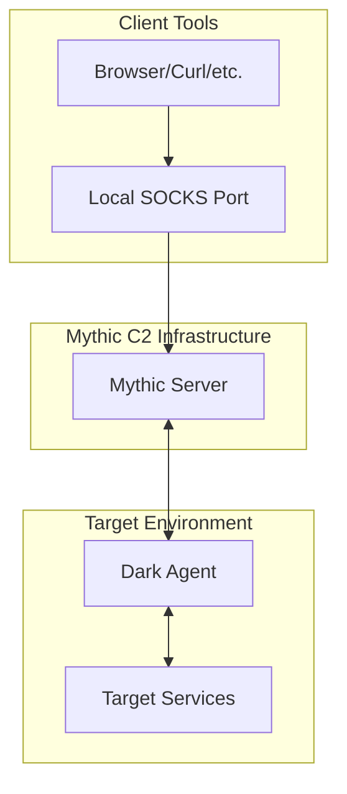
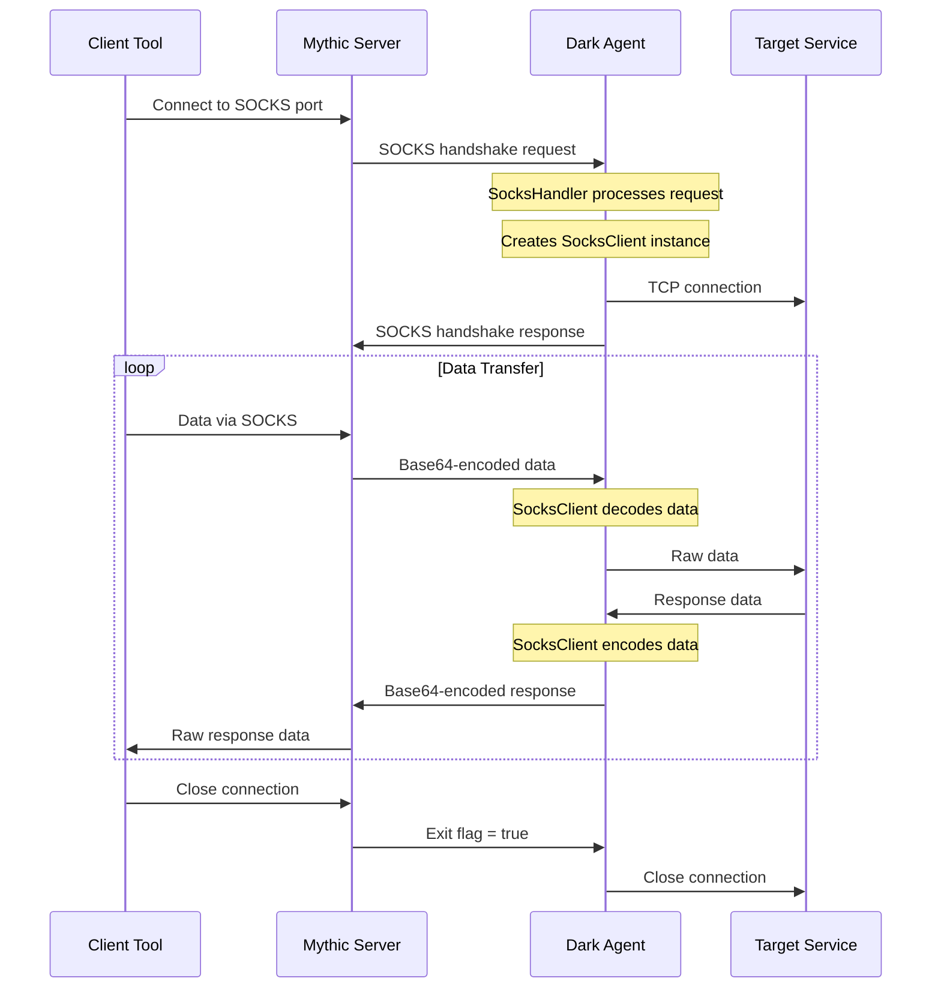
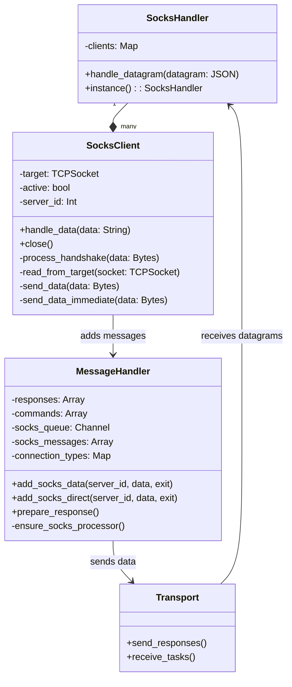
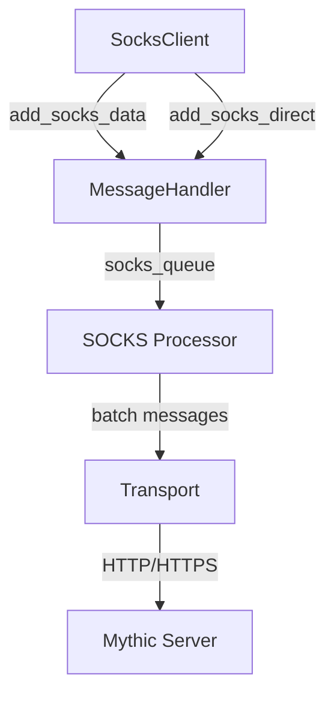
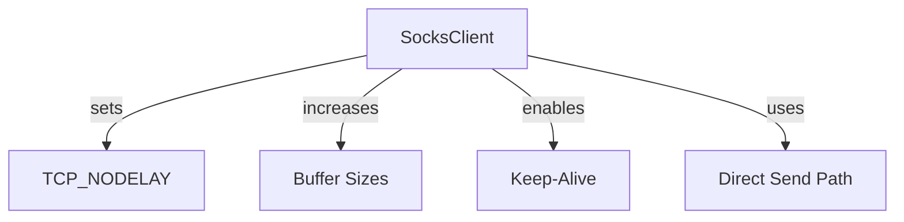

# SOCKS Implementation

This document details the SOCKS proxy implementation in Dark Agent, explaining the data flow, components, and optimization opportunities.

## Overview

The SOCKS implementation in Dark Agent provides a SOCKS5-compliant proxy that enables secure tunneling of TCP connections through the agent. This allows operators to access remote network resources through the agent's network context.

## Command Usage

```
socks <port> [start|stop]
```

- `port`: The local port on the Mythic server to start the SOCKS proxy on
- `action`: Optional parameter, either "start" (default) or "stop"

Example:
```
socks 1080
```

## Architecture



## Detailed Data Flow



## Internal Component Architecture



## Optimization Points

The current SOCKS implementation has several areas for optimization:

### High-Performance Messaging



1. **Batching System**:
   - Messages are batched based on connection type
   - Interactive connections (small packets) are sent more frequently
   - Large transfers use bigger batches for efficiency

2. **Thread Safety**:
   - Uses mutex for thread-safe operations
   - Channel-based queue for high throughput

### Socket Optimizations

The implementation includes several socket-level optimizations:



1. **Socket Configuration**:
   - TCP_NODELAY: Disabled Nagle's algorithm for better interactivity
   - Larger buffers (256KB) for better throughput
   - Socket keep-alive for maintaining connections

2. **Handling Different Traffic Types**:
   - Interactive mode: Optimized for responsiveness (small packets)
   - Large transfer mode: Optimized for throughput (larger batches)

## Implementation Details

### Data Processing

1. **Encoding**:
   - All SOCKS data is Base64 encoded for transport over HTTP/HTTPS
   - Adds overhead but ensures compatibility with HTTP transport

2. **Transport Layer**:
   - HTTP polling-based communication
   - Large payloads (>256KB or >5 messages) use async non-blocking sends

3. **Message Processing**:
   - Thread-safe operations with mutex synchronization
   - Background fiber processes data every 1ms
   - Batching system for efficient data transmission

## Technical Details

### Protocol Constants and Enums

The SOCKS implementation supports SOCKS5 with the following features:

- Address types: IPv4, IPv6, and FQDN (domain names)
- Commands: Connect (supported), Bind and Associate (not implemented)
- Reply codes: Full RFC1928 compliant response codes

### Data Encoding

- All SOCKS data is Base64 encoded for transport over HTTP/HTTPS
- Initial connection request includes target information (IP:port)
- Data messages contain raw socket data (encoded)
- Exit messages signal connection termination

### Thread Model

- SOCKS processing occurs in multiple Fibers (Crystal's lightweight threads)
- Separate Fibers handle:
  - Initial connection processing
  - Reading from target sockets
  - Data batch processing
  - Keep-alive maintenance

### Error Handling

The implementation includes robust error handling:

- Socket timeouts with retry mechanism
- Connection errors with appropriate SOCKS reply codes
- Resource cleanup on connection termination

## Conclusion

The SOCKS implementation in Dark Agent provides a functional and reliable SOCKS5 proxy capability with support for IPv4, IPv6, and domain name resolution. The implementation handles connection pooling, efficient data batching, and robust error handling to provide a stable proxy service for accessing remote network resources through the agent.
